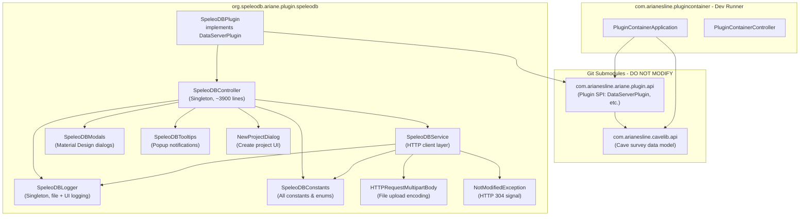
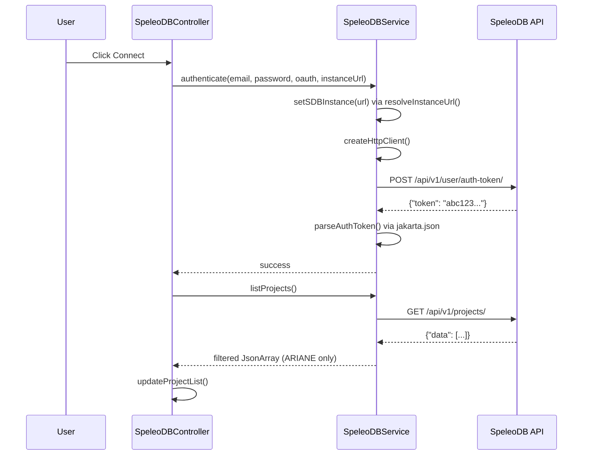
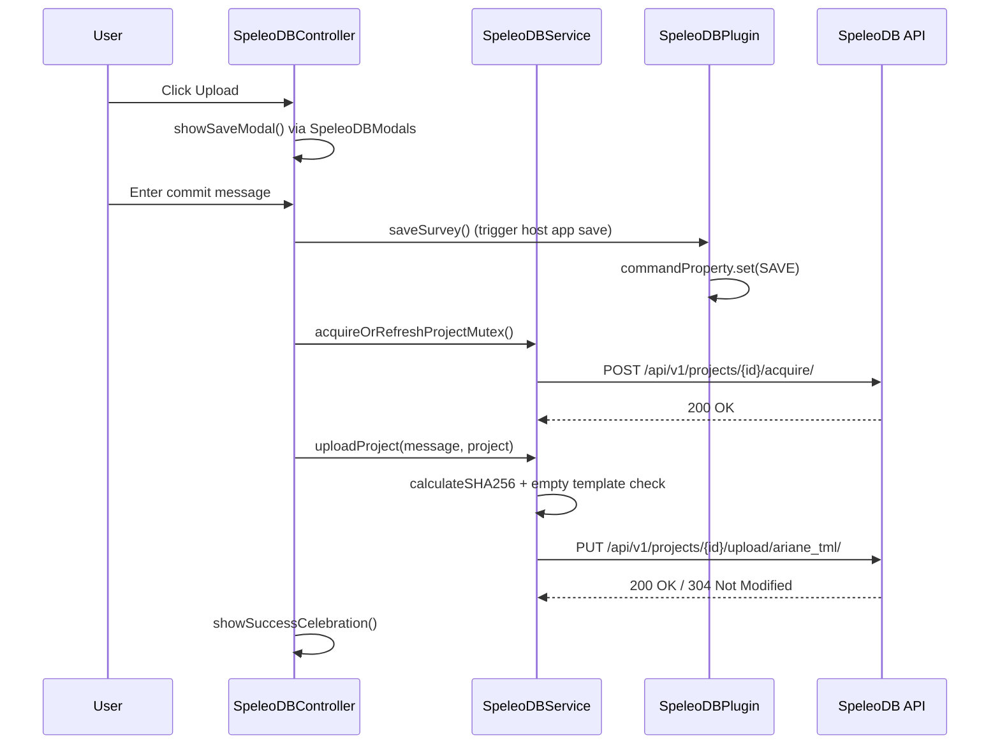

# SpeleoDB Plugin Architecture

## Module Dependency Graph



## Component Responsibilities

### SpeleoDBPlugin (SPI Entry Point)
- Implements `DataServerPlugin` from the Ariane plugin API
- Manages lifecycle: `showUI()`, `closeUI()`, `getUINode()`
- Owns the `ExecutorService` for background tasks
- Bridges FXML loading with singleton controller
- Handles JVM shutdown hook for lock release

### SpeleoDBController (UI Controller - Singleton)
- FXML controller for `SpeleoDB.fxml`
- Manages all UI state: authentication, project list, current project, locks
- Coordinates between `SpeleoDBService` (network) and `SpeleoDBModals` (dialogs)
- Uses `CountDownLatch` to guard against FXML initialization races
- Handles keyboard shortcuts (Ctrl+S/Cmd+S for save)

### SpeleoDBService (Network Layer)
- Encapsulates all HTTP communication with the SpeleoDB REST API
- Manages authentication state (`authToken`, `sdbInstance`)
- URL normalization: auto-detects local vs remote hosts for http/https
- Creates protocol-appropriate `HttpClient` instances
- JSON parsing via `jakarta.json` API

### SpeleoDBModals (Dialog Layer)
- All modal dialogs: confirmation, error, warning, info, input, success celebration
- Material Design styling with `createBaseAlert()` and `applySimpleDialogStyle()`
- Unified button styling via `applyMaterialButton()`
- CSS pre-warming for instant display

### SpeleoDBLogger (Logging Layer)
- Thread-safe file logging with automatic rotation (10 MB, 5 backups)
- UI console integration via `SpeleoDBController.appendToUILog()`
- Log levels: DEBUG (file only), INFO/WARN/ERROR (file + UI)
- Graceful shutdown with file flush before flag

## Data Flow: Authentication



## Data Flow: Upload/Download Cycle



## JPMS Module Structure

```java
module org.speleodb.ariane.plugin.speleodb {
    requires com.arianesline.ariane.plugin.api;
    requires com.arianesline.cavelib.api;
    requires javafx.controls;
    requires javafx.fxml;
    requires javafx.web;
    requires jakarta.json;
    // ...
    provides DataServerPlugin with SpeleoDBPlugin;
}
```

The plugin is discovered by the host application via Java's `ServiceLoader` mechanism, using the `provides ... with` directive.
