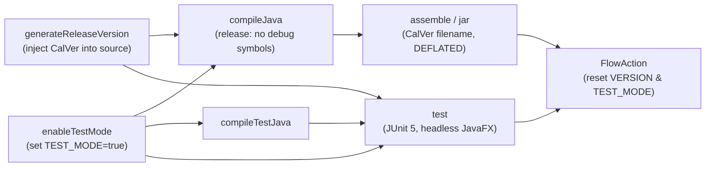

# Build and Release

## CalVer Versioning

The plugin uses Calendar Versioning in `YYYY.MM.DD` format:
- Version is generated at build time by the `generateReleaseVersion` Gradle task
- It mutates `SpeleoDBConstants.java` to replace `VERSION = null` with `VERSION = "YYYY.MM.DD"`
- After every build, a FlowAction in `settings.gradle` resets VERSION back to `null`
- This ensures the source tree stays clean while built artifacts carry the correct version

## Build Pipeline

## Gradle Tasks

| Task | Description |
|------|-------------|
| `./gradlew build` | Assemble JAR only (no tests) |
| `./gradlew build test` | Build and run all tests |
| `./gradlew check` | Run tests and checks |
| `./gradlew copyPlugin` | Copy built JAR to plugincontainer |
| `./gradlew copyAndRun` | Copy JAR and launch dev container |
| `./gradlew generateReleaseVersion` | Inject CalVer into source |
| `./gradlew enableTestMode` | Set TEST_MODE=true for test isolation |
| `./gradlew help-build` | Show available build tasks |

## CI Pipeline (GitHub Actions)

Defined in `.github/workflows/gradle.yml`:

1. Checkout with recursive submodules
2. Setup JDK 21 (Temurin)
3. Setup Gradle (caching)
4. `./gradlew build test`
5. Separate job: dependency graph submission for Dependabot

Pre-commit hooks (submodule-level): trailing whitespace, EOF fixer, JSON/XML/YAML checks, private key detection.

## JAR Packaging

- Filename: `org.speleodb.ariane.plugin.speleodb-YYYY.MM.DD.jar`
- Compression: DEFLATED with ZIP64 extensions
- Manifest: sealed, Implementation-Title/Version/Vendor, Built-By, Build-Jdk
- Excludes: `*.psd` files (kept in repo for design reference)
- No debug symbols (`options.debug = false`)

## Submodule Management

Three git submodules defined in `.gitmodules`:

| Submodule | Source | Purpose |
|-----------|--------|---------|
| `com.arianesline.ariane.plugin.api` | `Ariane-s-Line/com.arianesline.ariane.plugin.api` | Plugin interface contracts |
| `com.arianesline.cavelib.api` | `Ariane-s-Line/com.arianesline.cavelib.api` | Cave survey data model |
| `org.speleodb.ariane.plugin.speleodb` | `OpenSpeleo/org.speleodb.ariane.plugin.speleodb` | Plugin source code |

CI checks out with `submodules: recursive` to ensure all dependencies are available.

## Plugin Installation

Users install the plugin by copying the JAR file to Ariane's `~/.ariane/Plugins/` directory. The plugin self-update mechanism can download and replace its own JAR, requiring an Ariane restart.
